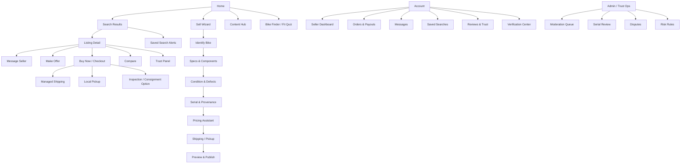
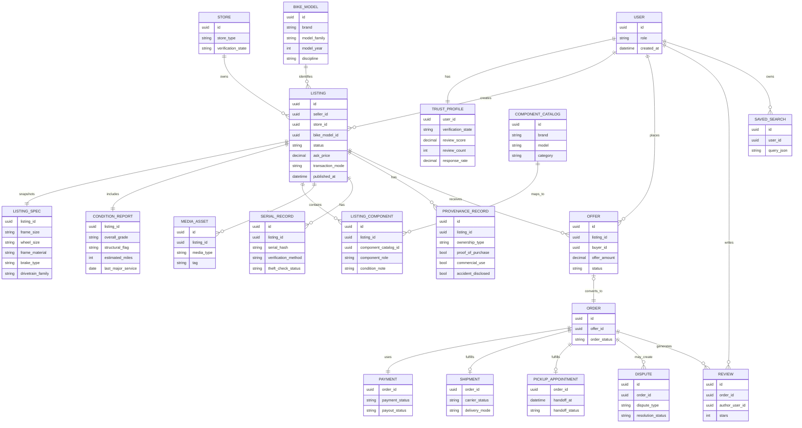

# Building a Superior Bicycle Classified Marketplace

## Executive Summary

The current bike-marketplace landscape is fragmented into three buckets. First are community-led classifieds that drive liquidity with audience fit but leave trust and payments largely off-platform, most clearly Pinkbike and Craigslist, with OfferUp now leaning even more local after ending nationwide shipping on September 23, 2025. Second are managed-transaction marketplaces such as buycycle, BicycleBlueBook Direct Seller, and eBay, which add escrow-like payment control, shipping support, or platform dispute processes. Third are non-classified benchmarks such as The Pro’s Closet and BikeExchange: one is effectively an inventory-led certified reseller/trade-in business, while the other is primarily a dealer marketplace and e-commerce enablement layer rather than a consumer-first peer-to-peer classifieds product. citeturn39view1turn16search2turn21search0turn20search3turn35search3turn28search1turn23view1turn0search7

No incumbent combines all of the capabilities that matter most for a superior bike classifieds site: bike-native structured data, pricing intelligence, serial/provenance capture, safe checkout for both shipped and local transactions, seller analytics, and real cycling community. Pinkbike has the strongest enthusiast audience and forums; BicycleBlueBook has the strongest explicit value-guide anchor; buycycle has the best bike-specific logistics flow; The Pro’s Closet has the highest trust via inspection and refurbishment; eBay has the deepest seller tooling and advertising stack; OfferUp has a credible mobile insights/reputation layer; and BikeExchange has the strongest dealer integrations and retail SEO/marketing support. The opportunity is to synthesize these strengths into a single product. citeturn41search3turn17search4turn20search14turn24search8turn29view1turn31search2turn36search0

The recommended launch wedge is a web-first, US-focused marketplace for complete bikes, frames, and premium wheelsets, using a hybrid transaction model: local meetup, managed shipping, or certified-inspection/consignment. That wedge targets the highest-value transactions where trust, fit, condition, and logistics matter enough to justify rich structured data and moderation. Pinkbike’s off-platform payments, BicycleBlueBook’s limited direct-seller mediation, buycycle’s reduced protection for local pickup, OfferUp’s local-only posture, and eBay’s generic taxonomy all point to the same conclusion: the winning product is not “another classifieds forum,” but a bike-native transaction operating system. citeturn39view1turn35search3turn40search6turn21search0turn13view4

## Method and market frame

The benchmark set for this report includes entity["organization","Pinkbike","mountain biking website"] BuySell, entity["company","The Pro's Closet","used bike retailer"], entity["company","BikeExchange","dealer bike marketplace"], entity["company","eBay","online marketplace"], entity["company","Craigslist","classifieds website"], entity["company","BicycleBlueBook","bike valuation marketplace"], entity["company","buycycle","used bike marketplace"], and entity["company","OfferUp","local marketplace app"]. I prioritized official help centers, fee pages, terms, and live category/listing pages in English. Where a field or workflow is not publicly documented, it is labeled **publicly unspecified**.

| Marketplace      | Operating model                                                     | Core value proposition                                                   | Primary users                                                | Strategic read                                                                                                                                                        | Official basis                                                                                                                                                                                |
| ---------------- | ------------------------------------------------------------------- | ------------------------------------------------------------------------ | ------------------------------------------------------------ | --------------------------------------------------------------------------------------------------------------------------------------------------------------------- | --------------------------------------------------------------------------------------------------------------------------------------------------------------------------------------------- |
| Pinkbike         | Community-led bike classifieds inside MTB media/community           | Reach serious mountain-bike enthusiasts in a trusted rider context       | Private riders, shops, pros, MTB-first audience              | Best organic enthusiast liquidity and strongest native community; weakest native transaction control because Pinkbike does not handle payments or verify transactions | Official pages show forum/community integration, user reviews, listing workflow, and off-platform transaction responsibility. citeturn41search3turn39view1turn41search0turn27view1      |
| The Pro’s Closet | Inventory-led certified reseller, trade-in, cash offer, consignment | High-confidence pre-owned purchase and hassle-free sell/trade            | Riders prioritizing trust over open-market reach             | Best trust and buyer assurance; not a real open classifieds network                                                                                                   | TPC positions itself around CPO inspection/service, returns, and seller submission/quote flows rather than open P2P listings. citeturn23view1turn23view2turn23view4turn42search0        |
| BikeExchange     | Dealer marketplace plus retailer e-commerce services                | Compare dealer inventory, buy online, click/reserve collect              | Independent bike dealers, brands, retail buyers              | Strong dealer-commerce rails and merchandising; weak fit for private-person classifieds                                                                               | Current FAQ says the marketplace is not open for private sellers; B2B pages stress dealer solutions, inventory, PIM, checkout, and logistics. citeturn0search7turn36search0turn36search3 |
| eBay             | General marketplace with mature seller infrastructure               | Massive demand, broad buyer base, strong seller tooling                  | Power sellers, hobbyists, collectors, parts/flipping economy | Best seller instrumentation and protection stack; generic bike UX and a relatively heavy fee take                                                                     | eBay exposes category item specifics, Seller Hub, advertising, feedback, and Money Back Guarantee. citeturn13view4turn29view1turn29view2turn28search1                                   |
| Craigslist       | Local text-first classifieds                                        | Fast, low-friction, local cash-style transactions                        | Budget buyers/sellers, quick local deals                     | Fastest and cheapest local utility; lowest platform trust and structure                                                                                               | Official docs emphasize geographic posting, map, face-to-face safety, and category attributes. citeturn16search0turn16search2turn16search6turn16search10                                |
| BicycleBlueBook  | Hybrid bike marketplace centered on valuation                       | Fair-price anchor from value guide plus direct/local/store selling modes | Price-sensitive buyers, shops, direct sellers                | Best native pricing anchor; complicated multi-model marketplace and limited direct-seller mediation                                                                   | Official pages show value guide, direct seller/local/verified store modes, escrow, and dashboard/store tooling. citeturn17search4turn18search1turn19view1turn35search3turn35search4    |
| buycycle         | Bike-specific managed marketplace                                   | Bike-native selling wizard, secure payment, bike shipping                | Private and commercial sellers shipping bikes cross-region   | Best bike-specific checkout/logistics; lighter community and limited dealer bulk tooling                                                                              | Official pages show structured listing flow, shipping box/pickup, escrow/claims, and fee pages. citeturn34search0turn20search14turn20search3turn1search10turn34search1                 |
| OfferUp          | App-first local general marketplace                                 | Fast mobile posting and local buyer reach                                | Casual local sellers, mobile-first shoppers                  | Best mobile-local UX among generalists; no current nationwide shipping and thin bike specificity                                                                      | Official pages show app-first posting, ratings/badges, insights, promotions, and the shipping shutdown notice. citeturn21search1turn38search0turn31search2turn21search0                 |

## Comparative analysis

### Listing, fields, search, and UX

| Marketplace      | Listing workflow and fields                                                                                                                                                                                                                                                                                                                                              | Search and filters                                                                                                                                                                                                                                            | UX/UI assessment                                                                                                                                                                                                                                     | Official basis                                                                              |
| ---------------- | ------------------------------------------------------------------------------------------------------------------------------------------------------------------------------------------------------------------------------------------------------------------------------------------------------------------------------------------------------------------------ | ------------------------------------------------------------------------------------------------------------------------------------------------------------------------------------------------------------------------------------------------------------- | ---------------------------------------------------------------------------------------------------------------------------------------------------------------------------------------------------------------------------------------------------- | ------------------------------------------------------------------------------------------- |
| Pinkbike         | Login → “Post New Ad” → category → photos → product details → price → location → submit for review. Public sample listings expose category, condition, seller type, frame size, wheel size, material, and travel; serial/provenance appear to live in free text rather than a public structured field.                                                                   | Region, country, “Near Me,” plus category filters such as price, type, shipping, and other options. Search results visibly reuse structured bike fields in cards.                                                                                             | Information-dense and crawlable; strong category fit; legacy IA, with an explicit separate mobile site and left-side nav language in help docs suggesting an older interaction model.                                                                | citeturn41search0turn11view0turn11view1turn41search7turn27view1                      |
| The Pro’s Closet | Seller-side flow is submission-for-offer, not open listing: a few photos, identity verification, then a quote in roughly 24–48 hours. Buyer-side product pages are rich, with year, brand, model, size, frame material, drivetrain, weight, brakes, fit range, favorites, compare/watch, Bike Finder, and saved search. Public serial/provenance display is unspecified. | Strong retail browsing by category/brand/price band, fit guidance, Bike Finder, favorites, and saved search.                                                                                                                                                  | Polished specialty-retail UX with strong trust cues and fit help; weak if the goal is a self-serve classifieds network because sellers do not control their own live listings.                                                                       | citeturn23view0turn23view5turn24search4turn24search5turn24search7                    |
| BikeExchange     | Public seller flow is dealer-oriented and tied to inventory/PIM/commerce services; private-seller flow is not publicly available in the current US FAQ. Product/listing quality is expected to be dealer-grade.                                                                                                                                                          | Consumer site supports click-and-collect, reserve-and-collect, bike size calculator, and brand/model discovery; indexed pages point to frame sizes, colors, and wheel sizes, while B2B pages highlight AI-enhanced search and product information management. | Good retail commerce UX, but conceptually split between consumer storefront and B2B retailer tooling; messaging can be inconsistent because some indexed copy still references private sellers while the FAQ says private sellers are not supported. | citeturn0search7turn25search2turn25search3turn25search6turn36search0turn33search5   |
| eBay             | Advanced listing tool supports photos, video, category, description, pricing, shipping, payment/returns preferences, and promotion settings. Bike/item pages expose category-specific item specifics such as condition, frame size, wheel size, material, and compatible bike type. Structured serial/provenance requirements for bikes are publicly unspecified.        | Deep faceting and huge category breadth; bike-category pages clearly show item-specific filters such as frame size, wheel size, material, and bike type, plus local-pickup filters.                                                                           | Extremely capable but noisy. Best for power users and inventory breadth, not for a bike-native “one screen tells the whole story” experience.                                                                                                        | citeturn29view0turn13view2turn13view4turn43search2                                    |
| Craigslist       | Choose site → create posting → location → type → category → text → map → images → preview/publish; may require email or phone confirmation. Attributes are category-specific and publicly generalized rather than bike-native.                                                                                                                                           | Category attributes, geographic search, map pinning, display modes, and Boolean operators.                                                                                                                                                                    | Very fast and light. Also the least trust-rich and least bike-specialized public UX in the set.                                                                                                                                                      | citeturn16search0turn16search1turn16search4turn16search6turn16search7turn16search10 |
| BicycleBlueBook  | Sell flow promises listing in under 5 minutes: upload photos, add details, set price. Listings emphasize description, photos, condition, components, notable upgrades, and valuation. Public structured serial/provenance fields are unspecified.                                                                                                                        | Among the best public bike filters: seller type, bike type, brand & family, model, year, price, condition, deal rating, location, gender, frame size, wheel size, suspension, frame material, and brake type.                                                 | Clear value framing and strong fit-for-purpose filtering; the coexistence of BBB Direct, Verified Store, Local Classified, and BBB-owned inventory adds conceptual complexity.                                                                       | citeturn35search2turn18search0turn32search0turn32search9                              |
| buycycle         | Best documented bike-native wizard: bike type → basic info → condition, mileage, service history → components/upgrades → sale price with recommendation → photos. Real photos are required; stock images are disallowed; bulk CSV uploads are not supported.                                                                                                             | Public shop pages expose filters and URL facets around bike type, brand, size, frame material, condition, and other attributes; saved searches are supported on the buyer side.                                                                               | Focused, purpose-built, and modern. Complexity shifts from listing to fulfillment because shipping, pickup scheduling, claims, and payout rules are tightly orchestrated.                                                                            | citeturn34search0turn34search1turn30search14turn40search11                            |
| OfferUp          | App-first flow: up to 12 photos, title, description, details, price, then finish. Public edit docs mention photos, title, description, condition, and price.                                                                                                                                                                                                             | Generic local faceting by subcategory and condition; bike browsing works, but taxonomy is broad rather than bike-native.                                                                                                                                      | Very fast for casual mobile posting. Weak for serious bike comparison because fit/spec/provenance are under-modeled.                                                                                                                                 | citeturn21search1turn21search5turn21search11turn21search15                            |

### Fees, payments, shipping, trust, analytics, and community

| Marketplace      | Fees and payments                                                                                                                                                                     | Shipping / meetup support                                                                                                                                                                | Trust and safety                                                                                                                                                                                                                                                               | Seller tooling, marketing, community                                                                                                                                                                                  | Official basis                                                                                                                                      |
| ---------------- | ------------------------------------------------------------------------------------------------------------------------------------------------------------------------------------- | ---------------------------------------------------------------------------------------------------------------------------------------------------------------------------------------- | ------------------------------------------------------------------------------------------------------------------------------------------------------------------------------------------------------------------------------------------------------------------------------ | --------------------------------------------------------------------------------------------------------------------------------------------------------------------------------------------------------------------- | --------------------------------------------------------------------------------------------------------------------------------------------------- |
| Pinkbike         | Free tier plus paid boost/subscription model: Basic free, Outside+ $89.99/year, Powerseller $349.95/year; boosts are $20 / $5 / $2 by tier. Pinkbike itself does not handle payments. | Seller can specify shipping restrictions from local-only to global.                                                                                                                      | User reviews, star ratings, badges, reporting reasons, moderator review of disputed feedback, safety guidance, but Pinkbike states users handle funds/products and it does not verify purchase or receipt.                                                                     | Views and watchers on listings, plus boosts for visibility. Exceptional adjacent community: forums, blogs, photos, videos.                                                                                            | citeturn27view1turn39view1turn39view0turn11view1turn41search3                                                                                |
| The Pro’s Closet | Not a public listing-fee model. Seller chooses cash, trade credit, or consignment; public payout/consignment economics beyond that are unspecified.                                   | Free shipping label or drop-off at TPC retail store for accepted seller submissions; buyer receives near-assembled bikes in RideFast boxes.                                              | Strongest trust stack in the set: owner ID and serial verification on intake, in-house inspection/service, CPO process, 30-day returns.                                                                                                                                        | Strong buyer marketing/community stack: magazine, reviews, rewards, saved searches, Bike Finder, Ride Guide chat. Public self-serve seller analytics are unspecified.                                                 | citeturn23view4turn23view5turn42search2turn23view1turn23view2turn24search11turn24search5                                                   |
| BikeExchange     | Merchant sales are subject to an agreed commission rate and service fees; consumer payment/installment purchasing includes Pay in Four up to $3,000 and monthly plans above that.     | Click & Collect and Reserve & Collect are first-class flows; terms state the seller is paid after proof of dispatch, typically within 10 calendar days.                                  | US marketplace is retailer/shop-oriented rather than private-seller open. Returns and withdrawal rights are part of the commerce flow.                                                                                                                                         | Seller side is unusually strong for dealers: SEO/marketing services, Google/Bing/Meta feed management, inventory management, PIM, logistics, and store review system. No real rider-community/forum layer is evident. | citeturn25search0turn25search5turn25search3turn25search6turn4view0turn36search0turn36search1turn36search5                                 |
| eBay             | First 250 listings per month are free in most categories, then $0.35 insertion; most categories pay 13.6% of the sale up to $7,500 and 2.35% above that.                              | Full shipping support or local pickup, including QR/6-digit proof-of-pickup workflows.                                                                                                   | Very mature system: feedback profiles, verified purchase labeling, Money Back Guarantee, seller protections, dispute handling, and appeals.                                                                                                                                    | Best seller toolchain in the set: Seller Hub, reports, performance dashboards, advertising, promoted listings, promoted stores, offsite traffic, store newsletters, plus community forums/reviews/guides.             | citeturn13view0turn43search1turn43search2turn28search0turn28search1turn13view1turn29view1turn29view2turn28search16                       |
| Craigslist       | Only some categories and geographies are paid; public fee docs do not identify ordinary bike-for-sale classifieds as a standard paid category. Platform payment/escrow is absent.     | Strongly local and face-to-face, with map and subarea support.                                                                                                                           | Official safety guidance is explicit: deal locally, face-to-face. Reporting exists, but dispute resolution is effectively off-platform.                                                                                                                                        | Minimal seller tooling beyond create/edit/delete and display/search options. No formal marketing or community engine for bike sellers.                                                                                | citeturn2view12turn16search16turn16search17turn16search2turn16search14                                                                       |
| BicycleBlueBook  | Local Classified: $0; Direct Seller: 7% + 2.9% + $0.30; Verified Store: 5% + 2.9% + $0.30. Listing is promoted as free until sale.                                                    | Direct sellers can use integrated shipping or local pickup; FAQ cites $85 bike shipping in the lower 48 for standard bike boxes and in-platform label printing for recommended shipping. | Stronger than Pinkbike/Craigslist for remote sales: escrow until buyer receipt, buyer/seller screening and fraud detection, secure messaging. Important caveat: for Direct Seller, disputes are handled between buyer and seller and BicycleBlueBook says it will not mediate. | Verified Stores get dashboard/activity/sales-history/margin tools; Value Guide and Bike Finder are real acquisition assets. No meaningful community/forum layer.                                                      | citeturn19view1turn17search7turn19view2turn19view0turn35search3turn35search4                                                                |
| buycycle         | Seller fee for bikes/frames is 7.5%; buyer fees for bikes/frames are 1.5% of sale price; US bike/frame shipping is listed at $99.                                                     | Strongest bike-shipping lane: platform packaging, scheduled pickup, labels, tracking, plus self-pickup/test-ride flow with on-platform payment.                                          | Secure payments held until successful delivery, buyer-protection claims, seller protection for transport damage, claim handling by a specialized team. Important caveat: buyer protection does not apply to local pickups.                                                     | Good operational tooling but lighter growth tooling: price recommendation, guided listing, saved searches. Public dealer-grade bulk upload is not supported.                                                          | citeturn1search10turn20search10turn20search3turn20search14turn40search1turn40search6turn34search4turn34search1turn40search11             |
| OfferUp          | Up to 200 free listings per month across most categories; paid single listings vary by category; Promote Plus is $19.99/month or $99.99/year.                                         | Current item sales are fundamentally local because nationwide shipping ended in late 2025. In-person payment is arranged between parties.                                                | Good local trust layer for a generalist: ratings, compliments, public badges, verified email/phone, TruYou identity verification, reply-rate badge, support chat, and law-enforcement portal support.                                                                          | Better analytics than most local marketplaces: Insights dashboard and promotion results, plus feed promotion. Community remains lightweight and local rather than enthusiast/deeply editorial.                        | citeturn37search1turn37search0turn31search3turn21search0turn21search12turn38search0turn38search1turn38search2turn31search2turn38search9 |

The comparative pattern is clear. Bike-native structure is strongest on BicycleBlueBook, buycycle, and The Pro’s Closet; community and organic audience are strongest on Pinkbike; transactional safety is strongest on eBay, buycycle, and TPC; local-frictionless velocity is strongest on Craigslist and OfferUp; and dealer enablement is strongest on BikeExchange. Nobody owns all five simultaneously. citeturn18search0turn34search0turn23view1turn41search3turn28search1turn16search2turn36search0

The most consequential missed opportunity across incumbents is that **provenance is still not a first-class data object**. TPC verifies owner identity and serial on intake, Pinkbike explicitly tells buyers to check serials against stolen-bike databases, buycycle collects condition/service history, and BicycleBlueBook emphasizes detailed descriptions and screening, but no major open marketplace makes serial verification, ownership proof, service history, inspection source, and theft screening a unified, searchable trust layer for every listing. That is the single clearest gap a superior entrant can exploit. citeturn42search2turn41search1turn34search0turn35search3

## What a superior site should do

A superior bicycle classifieds site should deliberately combine five behaviors that incumbents separate:

| Priority | Feature set                                                                                       | Why it matters                                                                                                                                                                                         |
| -------- | ------------------------------------------------------------------------------------------------- | ------------------------------------------------------------------------------------------------------------------------------------------------------------------------------------------------------ |
| P0       | **Bike-native listing wizard backed by a canonical bike/model catalog**                           | Generic title/description flows force the most important facts into prose. The new site should pre-fill known specs from a bike database, then let the seller override with “as-built” configuration.  |
| P0       | **Structured condition, service history, serial, and provenance objects**                         | Buyers overpay or walk away because they cannot quickly answer: Is it stolen? Is the frame sound? What has been replaced? When was the suspension serviced?                                            |
| P0       | **Hybrid transaction modes: managed shipping, local pickup, or certified inspection/consignment** | Different buyers want different levels of assurance. A superior site should not force the Pinkbike/Craigslist choice or the buycycle-only choice.                                                      |
| P0       | **Pricing assistant using market comps plus seller control**                                      | BicycleBlueBook proves the value of anchored pricing; buycycle proves guided pricing helps conversion. A new entrant should show suggested price band, expected days-to-sell, and confidence interval. |
| P0       | **Trust graph visible at listing level**                                                          | Reviews alone are too weak. Each listing should expose trust badges tied to verified identity, serial proof, receipt/provenance proof, inspection status, service recency, and responsiveness.         |
| P0       | **Seller dashboard with views, saves, inquiries, offer conversion, price-position index**         | eBay and OfferUp demonstrate that seller instrumentation changes behavior; most bike-specific products underdeliver here.                                                                              |
| P1       | **Dealer/store accounts, consignment rails, and local mechanic inspection partners**              | BikeExchange and TPC show that shops can be major supply sources and trust multipliers.                                                                                                                |
| P1       | **Bike Finder, fit calculator, compare, saved searches, and alerting**                            | TPC, BBB, and buycycle all show fragments of this. Combined, they create habit and retention.                                                                                                          |
| P1       | **Editorial/community layer with reviews, guides, buyer checklists, and ride/local-club context** | Pinkbike’s community distribution is a defensible acquisition wedge that transactional products lack.                                                                                                  |
| P2       | **Financing, warranty/insurance add-ons, trade-in lead generation, and API-fed dealer inventory** | These expand revenue after the core marketplace is liquid and trustworthy.                                                                                                                             |

The product principles behind that table are straightforward. First, every high-value listing should “read like a service record,” not like a forum post. Second, trust should be evidence-based, not biography-based. Third, the marketplace should support both local and shipped transactions without making one feel bolted on. Fourth, payments and logistics should disappear into the flow rather than become separate negotiation threads. Fifth, the product should create repeat buyer behavior through saved searches, fit tools, and editorial relevance, not just one-off transactions. These principles directly answer the gaps exposed by Pinkbike’s off-platform exchange model, Craigslist’s local-only safety posture, BicycleBlueBook’s dispute limits, buycycle’s local-pickup caveat, and eBay’s generic item model. citeturn39view1turn16search2turn35search3turn40search6turn13view4

## Information architecture and data model

The sitemap should keep buyers on a simple browse-detail-buy path while giving sellers a guided “publish with trust evidence” flow.

That IA keeps buyer-facing pages few and strong, while concentrating seller friction into the wizard where it increases trust and conversion rather than leaking into off-platform messaging.

A practical page list for launch is below.

| Page                   | Purpose                                                                               | MVP            |
| ---------------------- | ------------------------------------------------------------------------------------- | -------------- |
| Home                   | Value prop, featured inventory, trust explainer, categories, editorial modules        | Yes            |
| Search results         | Faceted bike-native browse, sort, map/local radius, saved search                      | Yes            |
| Listing detail         | Full spec snapshot, defect gallery, provenance panel, seller trust, offer/buy actions | Yes            |
| Sell wizard            | Guided publish flow with auto-spec fill, condition capture, pricing assistance        | Yes            |
| Seller dashboard       | Listings, inquiries, saves, views, offer funnel, orders, payouts                      | Yes            |
| Checkout               | Managed shipping and local pickup handover flows                                      | Yes            |
| Message + offer thread | Questions, counteroffers, status changes, audit trail                                 | Yes            |
| Profile / trust center | Badges, reviews, verification states, response rate, dispute history                  | Yes            |
| Bike Finder / fit tool | Buyer qualification and lead generation                                               | Soon after MVP |
| Content hub            | Buying guides, service checklists, market reports, community reviews                  | Soon after MVP |
| Admin / moderation     | Fraud review, serial review, listing QA, disputes, refunds                            | Yes            |

The listing schema should be deliberately opinionated.

| Field group     | Required at publish                                                                                      |             Searchable |              Buyer-visible | Notes                                                     |
| --------------- | -------------------------------------------------------------------------------------------------------- | ---------------------: | -------------------------: | --------------------------------------------------------- |
| Identity        | Seller type, account age, verified profile state                                                         |                    Yes |                        Yes | Private, shop, consignment, certified partner             |
| Bike core       | Discipline, category, brand, model family, model year, frame size, fit range, wheel size, frame material |                    Yes |                        Yes | Canonical catalog-backed                                  |
| Build spec      | Fork, shock, drivetrain, brakes, wheels, cockpit, seatpost, charger/battery if e-bike                    | Yes for complete bikes |                        Yes | Stored as an as-built snapshot, not just catalog defaults |
| Condition       | Overall grade, cosmetic defect tags, structural issue flags, wear-item status, mileage/use estimate      |                    Yes |                        Yes | Include defect localization and severity                  |
| Service history | Last major service dates, suspension/brake/drivetrain work, shop-performed yes/no                        |         Recommended P0 |                        Yes | Trust multiplier                                          |
| Provenance      | Original owner yes/no, proof-of-purchase uploaded, race/demo/rental/commercial usage, accident history   |         Recommended P0 |                     Partly | Some evidence private, some badges public                 |
| Serial          | Serial hash, partial public display, theft-check status, verification method                             |         Recommended P0 | Badge + masked last digits | Full serial should not be fully public                    |
| Logistics       | Price, currency, OBO, accepted transaction modes, shipping region, local radius, pickup points           |                    Yes |                        Yes | Supports local + shipped from one schema                  |
| Media           | Hero image, gallery, defect closeups, short walkaround video                                             |                    Yes |                        Yes | Defect shots should be distinct field types               |
| Commerce        | Offer status, reserve, watch count, save count, promoted status                                          |                 System |                    Partial | Needed for dashboard and ranking                          |

The search and filter taxonomy should mirror how cyclists actually shop, not how general marketplaces classify objects:

- **Bike identity:** discipline, bike type, brand, model family, year.
- **Fit and size:** rider height band, frame size, wheel size, reach/stack band, fit range.
- **Build:** drivetrain family, brake type, suspension travel bands, e-bike motor/battery, frame material.
- **Condition and trust:** condition grade, inspection status, service recency, verified serial, proof of purchase, response rate, review score.
- **Price and value:** price, deal score, original MSRP delta, days on market, estimated shipping.
- **Logistics:** local radius, local pickup only, ships nationwide, certified-inspection available.
- **Seller type:** private seller, shop, verified store, consignment, certified partner.
- **Special situations:** race bike, demo bike, rental fleet, crash-repaired, aftermarket-heavy, stock build.

The database needs to reflect that trust and mechanical truth are as important as the listing itself.

That ER model intentionally makes **condition**, **serial**, and **provenance** first-class entities instead of stuffing them into free text, which is the central weakness of most benchmarks. Pinkbike, Craigslist, and OfferUp rely heavily on descriptions; eBay item specifics are richer but still generic; BicycleBlueBook, buycycle, and TPC prove the value of deeper structure but do not yet unify it into a universal trust graph for open classifieds. citeturn11view1turn16search10turn21search13turn13view4turn18search0turn34search0turn23view1

## Launch model and economics

The business model should be a hybrid of transaction revenue, seller tooling, and trust services.

| Monetization stream                | Recommendation                                                                        | Why it fits                                                                                 |
| ---------------------------------- | ------------------------------------------------------------------------------------- | ------------------------------------------------------------------------------------------- |
| Transaction fee                    | 5%–7% on managed-shipping sales; 2%–3% on local-protected handovers                   | BicycleBlueBook and buycycle validate that trust-heavy bike transactions can support a fee. |
| Boosted placement                  | Paid boosts or sponsored placement with clear labels                                  | Pinkbike and OfferUp prove sellers will pay for velocity.                                   |
| Seller subscription                | Pro tier for shops/high-volume sellers with bulk tools, analytics, branded storefront | BikeExchange and eBay validate subscription + tooling.                                      |
| Inspection / certification fee     | Optional mechanic inspection or “verified condition” badge                            | TPC shows trust is monetizable.                                                             |
| Shipping / packaging margin        | Pass-through plus modest margin on labels/packaging/insurance                         | buycycle and BBB show logistics can be productized.                                         |
| Financing / warranty referrals     | Later-stage attachment revenue                                                        | Bike buyers have high AOV and trust needs.                                                  |
| Trade-in and consignment lead fees | Revenue from shop partners or direct intake                                           | TPC and BBB prove trade-in/consignment demand exists.                                       |

A realistic MVP should **not** try to launch as an everything-for-everyone cycling classifieds site. The narrowest smart scope is:

- complete bikes, frames, and premium wheelsets only;
- US only at launch;
- one web app, not native apps;
- buyer/seller accounts, structured listing wizard, offers, managed shipping, local pickup, reviews, masked serial verification, moderation, saved searches, and seller dashboard;
- optional “verified inspection partner” badge in a few pilot metros.

That scope is enough to differentiate from Pinkbike and Craigslist on trust, from eBay on specificity, from BicycleBlueBook on mediation/tooling, from buycycle on local protection and analytics, and from TPC on open-market supply. citeturn39view1turn16search2turn13view4turn35search3turn31search2turn23view1

A pragmatic timeline is below.

| Phase                  |    Duration | Core deliverables                                                                               |
| ---------------------- | ----------: | ----------------------------------------------------------------------------------------------- |
| Discovery and IA       |   2–4 weeks | Requirements, marketplace policy, taxonomy, wireframes, moderation rules                        |
| Design and prototype   |   3–5 weeks | Visual system, listing wizard, listing detail, dashboard, checkout, admin                       |
| MVP engineering        | 10–14 weeks | Accounts, listing schema, search/facets, offers, payments, shipping/pickup, reviews, moderation |
| Beta and ops hardening |   4–6 weeks | Fraud workflows, support tooling, analytics, event logging, email/SMS, launch QA                |
| Initial launch         |   1–2 weeks | Controlled market release, concierge onboarding, early seller acquisition                       |

**Total MVP timeline:** roughly **4 to 6 months** for a disciplined first release.

Rough development and launch-cost ranges, stated as **author estimates based on the scope above**, are below.

| Cost band |      Rough range | Assumptions                                                                                                                                     |
| --------- | ---------------: | ----------------------------------------------------------------------------------------------------------------------------------------------- |
| Low       |   **$90k–$160k** | Small senior team, web-only, licensed search/payments services, limited custom pricing engine, no native apps, narrow moderation tooling        |
| Medium    |  **$180k–$350k** | Stronger design system, richer dashboard, marketplace ops tooling, shipping integrations, trust center, notification stack, analytics warehouse |
| High      | **$450k–$900k+** | Native apps, dealer feeds, ML pricing/fraud scoring, inspection network ops tooling, internationalization, deeper compliance and support stack  |

A rough ongoing monthly operating budget after launch is equally important: **$12k–$25k** low, **$30k–$70k** medium, **$80k–$180k+** high, depending mainly on support, moderation, paid acquisition, engineering retention, and transaction/compliance overhead. Those numbers are highly sensitive to GMV, dispute rates, and whether you operate certified inspections directly or via partners.

## Current interface references

The citations below are the most useful official pages to use as current screenshot/reference links while designing mockups or auditing flows:

- **Pinkbike**: listing workflow/help, area filtering, safety/reviews, and a representative listing detail page. citeturn41search0turn41search7turn39view0turn39view1turn11view0
- **The Pro’s Closet**: sell/trade landing, CPO explainer, returns page, and representative product detail pages. citeturn23view0turn23view1turn23view2turn24search4turn24search7
- **BikeExchange**: US homepage, click/reserve collect flows, FAQ/terms cues, and B2B dealer-service pages. citeturn25search2turn25search3turn25search6turn25search8turn36search0turn36search3
- **eBay**: advanced listing tool, bike category filter pages, Seller Hub, and local-pickup flow. citeturn29view0turn13view4turn29view1turn43search1turn43search2
- **Craigslist**: posting flow, filtering, map support, and safety guidance. citeturn16search0turn16search1turn16search6turn16search2
- **BicycleBlueBook**: sell page, bikes-for-sale marketplace, shipping options, and verified-store dashboard/help. citeturn35search2turn18search0turn19view2turn35search4
- **buycycle**: bike listing wizard, shop pages, shipping/packaging flow, and self-pickup/test-ride flow. citeturn34search0turn30search14turn20search14turn40search1turn40search12
- **OfferUp**: post-item flow, bike browse pages, trust-profile/badges, and insights/promotions tools. citeturn21search1turn21search11turn38search4turn38search2turn31search2turn31search1
